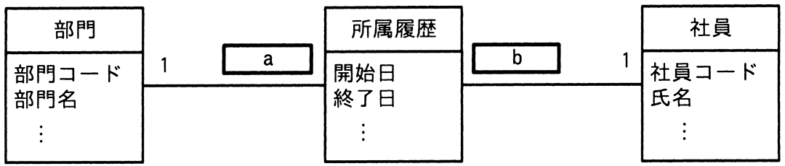
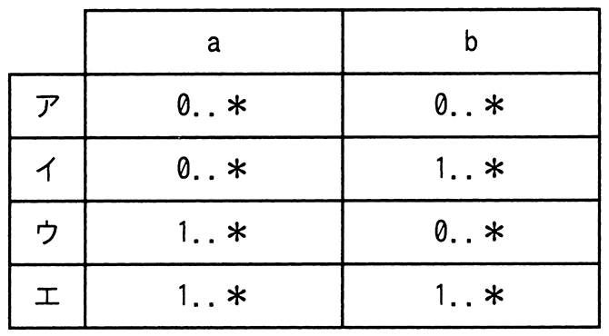

# 令和5年度春期 問29（技術要素）

## 問題文

UMLを用いて表した図のデータモデルのa，bに入れる多重度はどれか。

〔条件〕

（1）部門には1人以上の社員が所属する。

（2）社員はいずれか一つの部門に所属する。

（3）社員が部門に所属した履歴を所属履歴として記録する。

## 使用画像

## 解答と解説

**正解：エ**

図（AP2023SA029-01）は「部門 1 -[a]- 所属履歴 -[b]- 1 社員」という関連を表しており，aは部門1件に対応する所属履歴の多重度，bは社員1件に対応する所属履歴の多重度を表す。

条件（1）「部門には1人以上の社員が所属する」より，1つの部門には少なくとも1件（それ以上も可）の所属履歴が存在するため，a = 1..*となる。

条件（3）「社員が部門に所属した履歴を所属履歴として記録する」ことと，条件（2）「社員はいずれか一つの部門に所属する（現在）」を踏まえると，社員は入社時から少なくとも1回は部門に所属した記録（現在の所属を含む）を持つため，1人の社員に対応する所属履歴も少なくとも1件（異動があれば複数件）存在する。したがって b = 1..*となる。

以上より a=1..*，b=1..*の組合せである選択肢エ（AP2023SA029-02の表のエ行）が正解となる。他の選択肢は，部門または社員のいずれかで「0件でもよい（0..*）」としており，条件（1）（3）の「1件以上」という要件と矛盾するため誤りである。

**IPA公式：エ**

