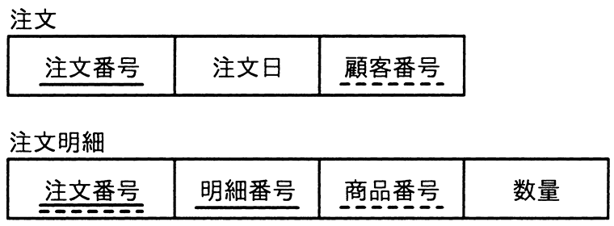

# 令和5年度春期 問30（技術要素）

## 問題文

図のような関係データベースの“注文”表と“注文明細”表がある。“注文”表の行を削除すると，対応する“注文明細”表の行が，自動的に削除されるようにしたい。参照制約定義の削除規則（ON DELETE）に指定する語句はどれか。ここで，図中の実線の下線は主キーを，破線の下線は外部キーを表す。

ア　CASCADE

イ　INTERSECT

ウ　RESTRICT

エ　UNIQUE

## 使用画像

## 解答と解説

**正解：ア**

図の“注文”表は注文番号を主キーとし，“注文明細”表は（注文番号，明細番号）を主キー，注文番号を外部キー（“注文”表を参照）として持つ。“注文”表の行が削除されたとき，対応する“注文明細”表の行も自動的に削除させたい場合，外部キー制約の削除規則（ON DELETE）に「CASCADE（連鎖）」を指定する。CASCADEを指定すると，親表（“注文”表）の行削除に連動して，それを参照する子表（“注文明細”表）の該当行も自動的に削除される。よって選択肢アが正解。

- イ：INTERSECTはSQLの集合演算子（積集合）であり，削除規則のキーワードではない。
- ウ：RESTRICTは，参照している子表の行が存在する場合に親表の行の削除自体を禁止（拒否）する規則であり，連動削除にはならない。
- エ：UNIQUEは列の値の一意性を保証する制約であり，削除規則とは無関係。

**IPA公式：ア**

