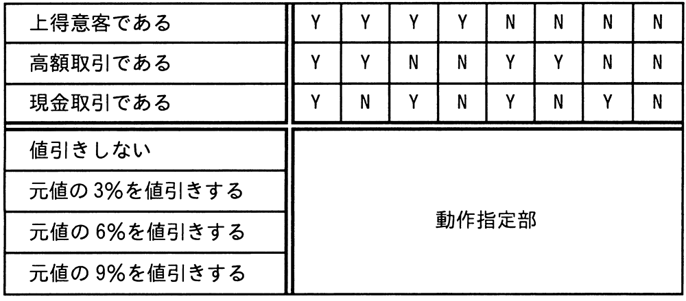
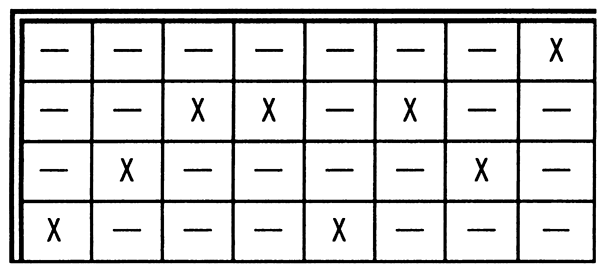
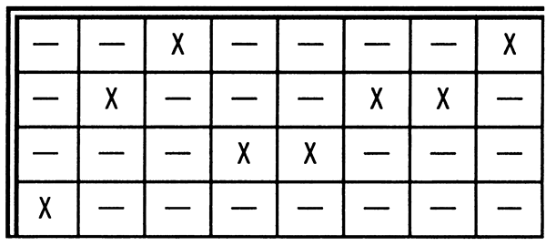
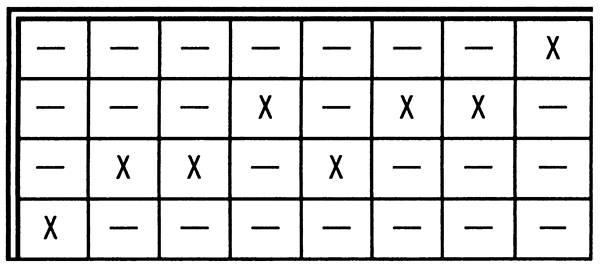
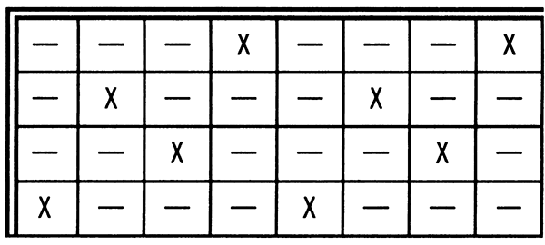

# 令和5年度春期 問47（開発技術）

## 問題文

値引き条件に従って，商品を販売する。決定表の動作指定部のうち，適切なものはどれか。

〔値引き条件〕

① 上得意客（前年度の販売金額の合計が800万円以上の顧客）であれば，元値の3％を値引きする。

② 高額取引（販売金額が100万円以上の取引）であれば，元値の3％を値引きする。

③ 現金取引であれば，元値の3％を値引きする。

④ ①～③の値引き条件は同時に適用する。

〔決定表〕

ア　

イ　

ウ　

エ

## 使用画像

