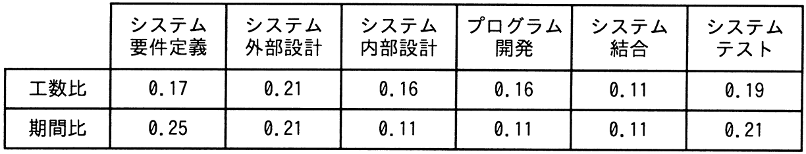

# 令和5年度春期 問53（マネジメント）

## 問題文

過去のプロジェクトの開発実績に基づいて構築した作業配分モデルがある。システム要件定義からシステム内部設計までをモデルどおりに進めて228日で完了し，プログラム開発を開始した。現在，200本のプログラムのうち100本のプログラムの開発を完了し，残りの100本は未着手の状況である。プログラム開発以降もモデルどおりに進捗すると仮定するとき，プロジェクトの完了まで，あと何日掛かるか。ここで，プログラムの開発に掛かる工数及び期間は，全てのプログラムで同一であるものとする。

〔作業配分モデル〕

ア　140

イ　150

ウ　161

エ　172

## 使用画像

