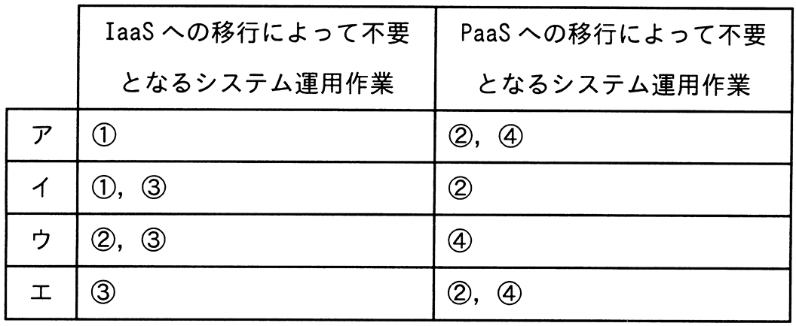

# 令和5年度春期 問57（ストラテジ）

## 問題文

A社は，自社がオンプレミスで運用している業務システムを，クラウドサービスへ段階的に移行する。段階的移行では，初めにネットワークとサーバをIaaSに移行し，次に全てのミドルウェアをPaaSに移行する。A社が行っているシステム運用作業のうち，この移行によって不要となる作業の組合せはどれか。

〔A社が行っているシステム運用作業〕

① 業務システムのバッチ処理のジョブ監視

② 物理サーバの起動，停止のオペレーション

③ ハードウェアの異常を警告する保守ランプの目視監視

④ ミドルウェアへのパッチ適用

## 使用画像

## 解答と解説

**正解：ウ**

IaaS（ネットワークとサーバの仮想化基盤への移行）によって、物理サーバやハードウェアそのものの管理はクラウド事業者側の責任範囲となる。そのため、②「物理サーバの起動，停止のオペレーション」や③「ハードウェアの異常を警告する保守ランプの目視監視」は、A社が自ら行う必要がなくなる。一方、①のバッチ処理のジョブ監視はアプリケーション・業務層の運用であり、IaaS化後もA社が引き続き実施する必要がある。

続いてPaaS（ミドルウェア層の移行）によって、OSやミドルウェアの保守・更新はクラウド事業者側の責任範囲に移るため、④「ミドルウェアへのパッチ適用」はA社にとって不要になる。

以上より、IaaS移行で不要となる作業は②・③、PaaS移行で不要となる作業は④であり、この組合せに一致するウが正解である。

**IPA公式：ウ**

