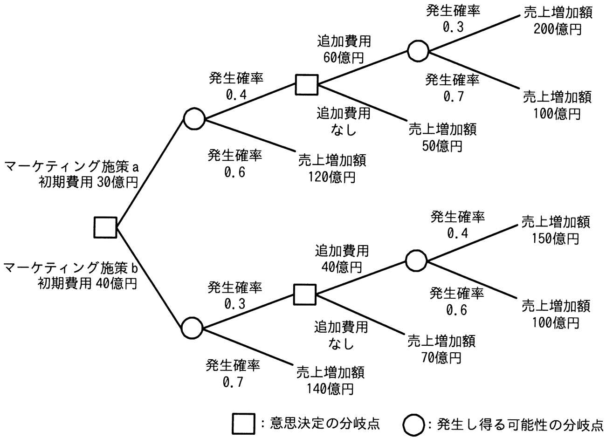
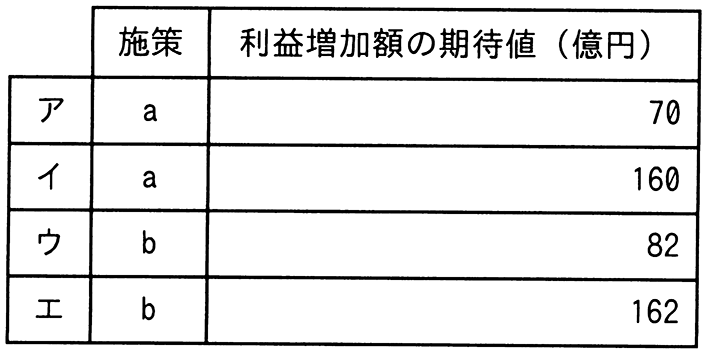

# 令和5年度春期 問75（ストラテジ）

## 問題文

ビッグデータ分析の手法の一つであるデシジョンツリーを活用してマーケティング施策の判断に必要な事象を整理し，発生確率の精度を向上させた上で二つのマーケティング施策a，bの選択を行う。マーケティング施策を実行した場合の利益増加額（売上増加額−費用）の期待値が最大となる施策と，そのときの利益増加額の期待値の組合せはどれか。

## 使用画像

## 解答と解説

**正解：ウ**

デシジョンツリー（決定木）を用いて，各分岐点での期待値を末端から順に計算する（バックワード・インダクション）。

**施策a（初期費用30億円）**

- 追加費用60億円の分岐点：発生確率0.3で売上増加額200億円，発生確率0.7で売上増加額100億円
  - 期待値＝0.3×200＋0.7×100＝60＋70＝130億円 → 追加費用60億円を差し引くと 130－60＝70億円
- 追加費用なしの場合：売上増加額50億円（そのまま50億円）
- 追加費用の意思決定点では，値の大きい方（70億円）を選択する
- 発生確率0.4でこの分岐（期待値70億円），発生確率0.6で売上増加額120億円
  - 期待値＝0.4×70＋0.6×120＝28＋72＝100億円
- 初期費用30億円を差し引く：100－30＝70億円

**施策b（初期費用40億円）**

- 追加費用40億円の分岐点：発生確率0.4で売上増加額150億円，発生確率0.6で売上増加額100億円
  - 期待値＝0.4×150＋0.6×100＝60＋60＝120億円 → 追加費用40億円を差し引くと 120－40＝80億円
- 追加費用なしの場合：売上増加額70億円
- 追加費用の意思決定点では，値の大きい方（80億円）を選択する
- 発生確率0.3でこの分岐（期待値80億円），発生確率0.7で売上増加額140億円
  - 期待値＝0.3×80＋0.7×140＝24＋98＝122億円
- 初期費用40億円を差し引く：122－40＝82億円

施策aの利益増加額の期待値は70億円，施策bは82億円であり，施策bの方が大きい。したがって，利益増加額の期待値が最大となるのは施策b，そのときの期待値は82億円であり，表中の「施策b，82」の組合せであるウが正解である。

**IPA公式：ウ**

