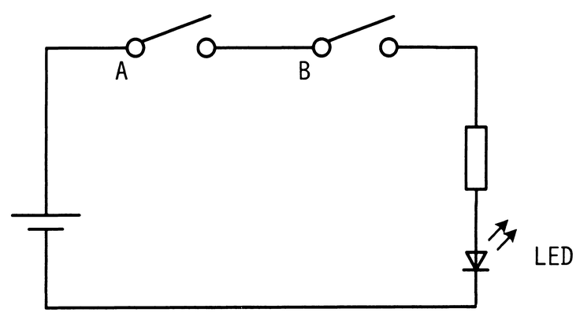
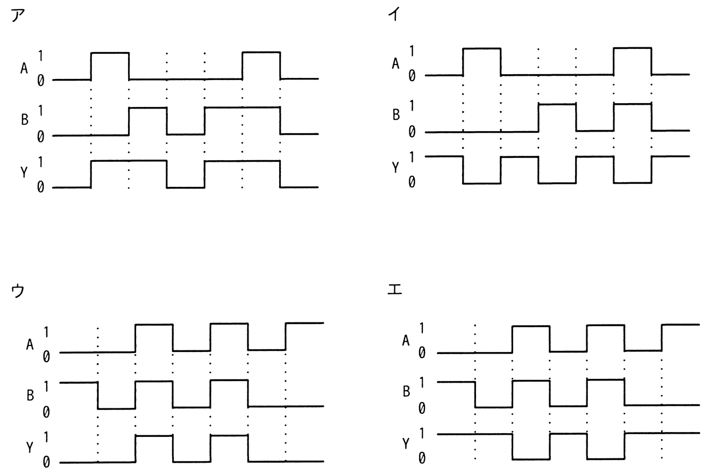

# 令和6年度秋期 問21（コンピュータシステム）

## 問題文

図はスイッチA及びBの状態によって，LEDが点灯又は消灯する回路である。スイッチAがオンの状態をA＝1，オフの状態をA＝0とし，スイッチBも同様にオンの状態をB＝1，オフの状態をB＝0とする。また，LEDが点灯する状態をY＝1，消灯する状態をY＝0とする。このとき，図の回路を動作させたときのタイミングチャートとして，適切なものはどれか。

## 使用画像

## 解答と解説

**正解：ウ**

回路図より，スイッチAとスイッチBは電源とLEDの間に直列に接続されている。したがって，電流が流れてLEDが点灯（Y＝1）するのは，AとBの両方がオン（A＝1かつB＝1）のときだけであり，これは論理積（AND）の関係，すなわちY＝A・Bで表される。

タイミングチャートのうち，AとBが同時に1（オン）になっている区間だけYが1になっているものを選ぶ必要がある。選択肢ウの波形は，AとBがともに1となる区間でYが1に立ち上がり，どちらか一方でも0になるとYが0に戻るという，AND回路として矛盾のない動作を示している。

一方，ア・イ・エはA又はBのいずれかのみが1の区間でもYが1になっていたり，AとBが同時に1でない区間でYが1になっていたりするなど，直列回路（AND）の動作と整合しない波形になっている。

**IPA公式：ウ**

