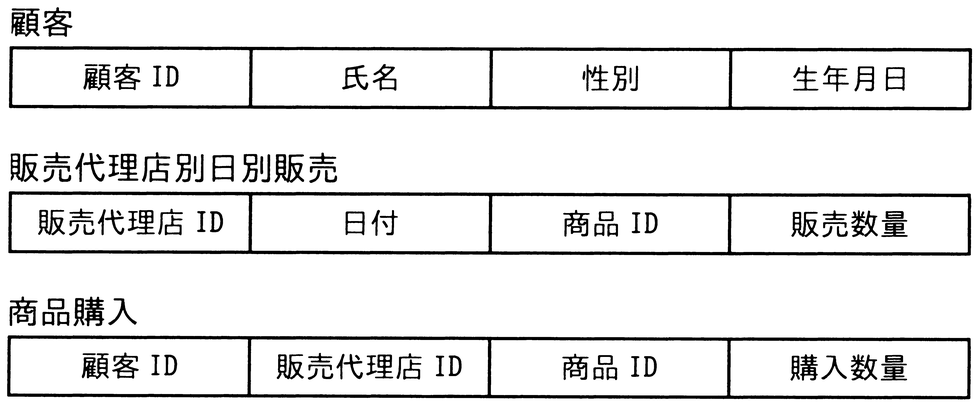

# 令和6年度秋期 問28（技術要素）

## 問題文

化粧品の製造を行っているA社では，販売代理店を通じて商品販売を行っている。今後の販売戦略に活用するために，次の三つの表を設計した。これらの表を用いるだけでは得ることのできない情報はどれか。

ア　商品ごとの販売数量の日別差異

イ　性別ごとの売れ筋商品

ウ　販売代理店ごとの購入者数の日別差異

エ　販売代理店ごとの売れ筋商品

## 使用画像

