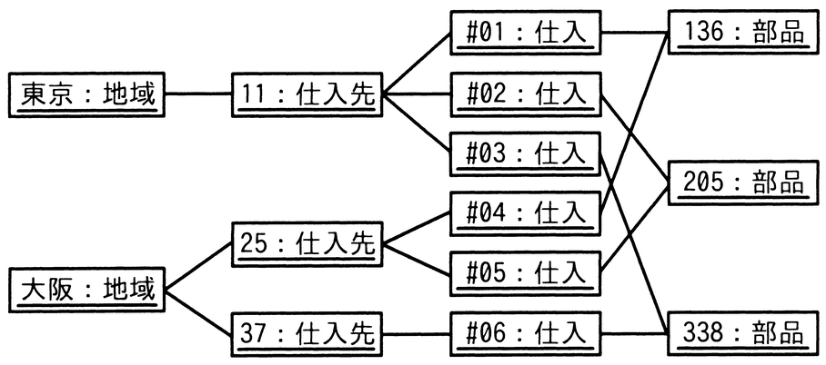
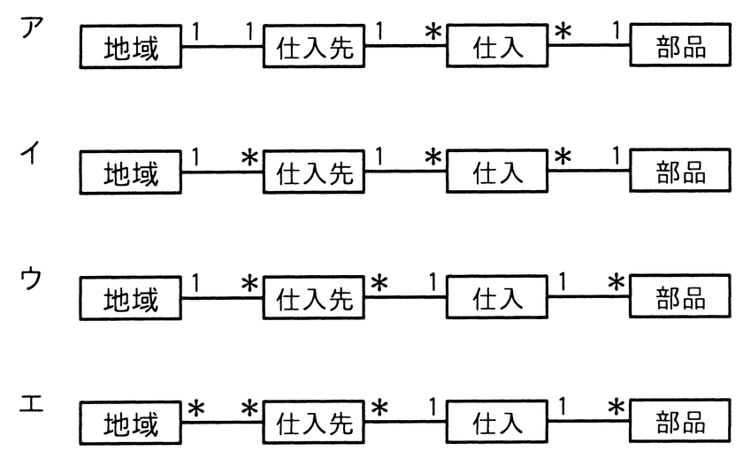

# 令和6年度秋期 問29（技術要素）

## 問題文

次のオブジェクト図（インスタンスを表す図）に対応する概念データモデルはどれか。ここで，オブジェクト図及び概念データモデルの表記にはUMLを用いる。

## 使用画像

## 解答と解説

**正解：イ**

オブジェクト図から，各クラス間のインスタンスの対応関係を読み取ると次のようになる。

- 「東京：地域」「大阪：地域」に対して，「11：仕入先」「25：仕入先」「37：仕入先」が存在し，東京には仕入先11が，大阪には仕入先25・37が対応しているので，1地域に複数の仕入先が対応し得る（地域1：仕入先多）。
- 「11：仕入先」には「#01」「#02」「#03」の仕入インスタンスが，「25：仕入先」には「#04」「#05」が，「37：仕入先」には「#06」が対応しており，1仕入先に対して複数の仕入インスタンスが存在する（仕入先1：仕入多）。
- 「仕入」と「部品」の対応では，例えば部品136には仕入#01と仕入#04が結び付いており，1つの部品が複数の仕入インスタンスから参照されている。すなわち，仕入側は複数（多）であるのに対し，部品側は1つに定まる構造である（仕入多：部品1）。

この対応関係をまとめると，「地域1－多仕入先」「仕入先1－多仕入」「仕入多－1部品」という多重度の連なりになる。選択肢の中でこの並びと一致するのは，地域と仕入先の間を1対＊，仕入先と仕入の間を1対＊，仕入と部品の間を＊対1としているイである。

アは地域と仕入先の間が1対1になっており，1地域に複数の仕入先が存在するオブジェクト図の構成と矛盾する。ウ・エは，仕入先と仕入の間，あるいは仕入と部品の間の多重度の向きがオブジェクト図の対応関係と一致しない。

**IPA公式：イ**
