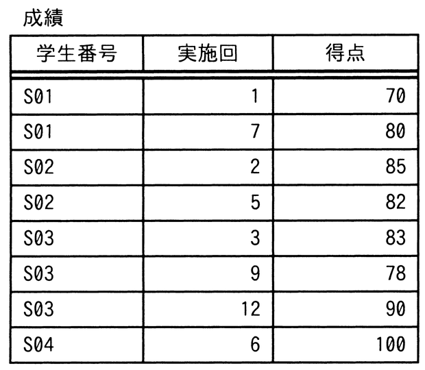

# 令和6年度秋期 問30（技術要素）

## 問題文

“成績”表に対して，SQL文1と同一の結果を得るために，SQL文2のaに入れる字句はどれか。

〔SQL文1〕

SELECT R1.学生番号, R1.実施回, R1.得点 FROM 成績 R1

　　INNER JOIN

　　(SELECT 学生番号, MIN(実施回) AS 初回 FROM 成績

　　　　GROUP BY 学生番号) R2

　　ON R1.学生番号 = R2.学生番号

　　AND R1.実施回 = R2.初回

〔SQL文2〕

SELECT 学生番号, 実施回, 得点

　　FROM (SELECT 学生番号, 実施回, 得点, ROW_NUMBER() OVER (   a   ) AS 番号

　　　　FROM 成績) R1

　　WHERE R1.番号 = 1

ア　ORDER BY 学生番号, 実施回

イ　PARTITION BY 学生番号 ORDER BY 実施回

ウ　PARTITION BY 学生番号 ORDER BY 得点 ASC

エ　PARTITION BY 学生番号 ORDER BY 得点 DESC

## 使用画像

## 解答と解説

**正解：イ**

SQL文1は，成績表を学生番号でグループ化し，各学生の最小の実施回（＝初回の実施回）を求めたサブクエリR2と，元の成績表R1を学生番号・実施回で結合することで，学生ごとに「実施回が最も小さい行（初回の成績）」だけを取り出している。

SQL文2は，ROW_NUMBER()関数を使って同じ結果を得る書き方である。ROW_NUMBER() OVER (PARTITION BY 列 ORDER BY 列) は，PARTITION BYで指定した列の値ごとにグループを分け，そのグループ内でORDER BYの順序に連番を振る関数である。学生ごとに実施回が最も小さい行の番号を1にするためには，「学生番号ごとに区切り（PARTITION BY 学生番号），実施回の昇順で連番を振る（ORDER BY 実施回）」必要がある。番号＝1の行を取り出せば，学生ごとの最小実施回の行，すなわちSQL文1と同じ結果が得られる。したがって，aに入る字句は「PARTITION BY 学生番号 ORDER BY 実施回」であり，イが正しい。

アはPARTITION BYがなく全体を1つの連番にしてしまうため，学生ごとの初回行が正しく取れない。ウ・エは得点でソートしており，実施回の最小値ではなく得点の最小／最大の行を取得することになり，SQL文1の意図（初回の成績を取得）と異なる。

**IPA公式：イ**
