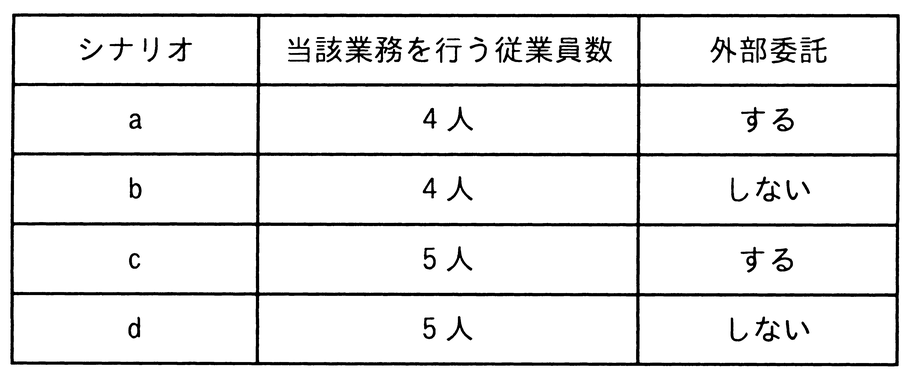

# 令和6年度秋期 問64（ストラテジ）

## 問題文

BPRによって業務を見直した場合，これまで従業員5人で年間計9,000時間掛かっていた業務が7,000時間で実現可能なことと，その7,000時間のうちの2,000時間分の業務は外部委託が可能なことが分かった。この結果を基にBPRを実施した次のシナリオaからdのうち，当該部門において，年間当たりの金額面の効果が最も高いものはどれか。なお，いずれのシナリオも年初から実施することとし，条件に記載した時間や費用以外は考慮しないものとする。

〔条件〕

　（1） 年間計9,000時間の内訳は従業員1人当たり1,800時間とする。

　（2） 従業員1人当たりの年間の人件費は600万円とする。

　（3） 外部委託が可能な2,000時間分の業務を，外部委託した場合の年間費用は700万円とする。外部委託の契約は1年単位で年間費用の700万円は固定である。

　（4） 従業員の空いた時間は別の付加価値業務が行えるようになり，従業員1人につき100時間当たり20万円の利益を得ることができる。

　（5） 従業員4人で当該業務を行う場合は，残り1人は他部門に異動する。当該部門では，1人分の人件費の削減効果だけを考慮する。

　（6） BPR実施後，当該業務に関わらない従業員の人件費は金額面の効果とみなす。

ア　シナリオa

イ　シナリオb

ウ　シナリオc

エ　シナリオd

31

## 使用画像

## 解答と解説

**正解：イ**

画像の表のとおり、シナリオa〜dは「当該業務を行う従業員数（4人 or 5人）」と「外部委託の有無」の組合せである。BPR実施後の金額面の効果を、次の考え方で試算する。

- ベースライン（BPR前）：5人×600万円＝3,000万円
- 各シナリオでの必要人員コスト：人数×600万円
- 外部委託する場合：社内対応は7,000－2,000＝5,000時間、外部委託費700万円が別途発生
- 外部委託しない場合：社内対応は7,000時間、委託費なし
- 空き時間（各人の年間キャパ1,800時間×人数－社内対応必要時間）は100時間当たり20万円の付加価値を生む
- 4人体制の場合、余った1人は他部門異動となり、その1人分の人件費600万円がそのまま部門の効果とみなせる（人件費コストとしては計上しない）

これに基づき年間効果（ベースライン3,000万円－人件費－外部委託費＋付加価値額）を試算すると、
- シナリオa（4人・委託する）：キャパ7,200h－社内対応5,000h＝余力2,200h→440万円、効果＝3,000－2,400－700＋440＝340万円
- シナリオb（4人・委託しない）：キャパ7,200h－社内対応7,000h＝余力200h→40万円、効果＝3,000－2,400－0＋40＝640万円
- シナリオc（5人・委託する）：キャパ9,000h－社内対応5,000h＝余力4,000h→800万円、効果＝3,000－3,000－700＋800＝100万円
- シナリオd（5人・委託しない）：キャパ9,000h－社内対応7,000h＝余力2,000h→400万円、効果＝3,000－3,000－0＋400＝400万円

最も効果が高いのはシナリオb（640万円）であり、4人体制で外部委託を使わず、浮いた社内時間を付加価値業務に充てるのが最も金額効果が大きい。

**IPA公式：イ**

