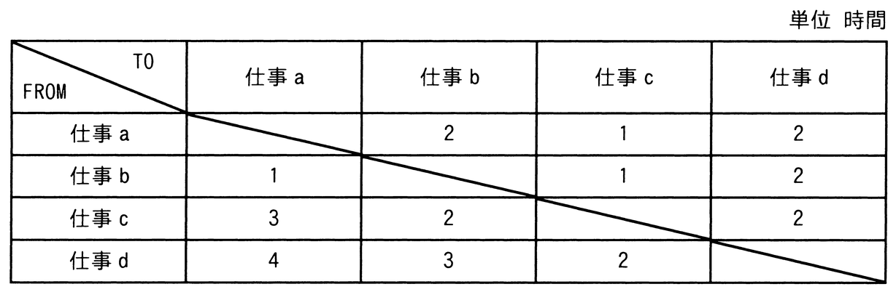

# 令和6年度秋期 問72（ストラテジ）

## 問題文

製造業のA社では，NC工作機械を用いて，四つの仕事a〜dを行っている。各仕事間の段取り時間は表のとおりである。合計の段取り時間が最小になるように仕事を行った場合の合計段取り時間は何時間か。ここで，仕事はどの順序で行ってもよく，a〜dを一度ずつ行うものとし，FROMからTOへの段取り時間で算出する。

ア　4

イ　5

ウ　6

エ　7

## 使用画像

