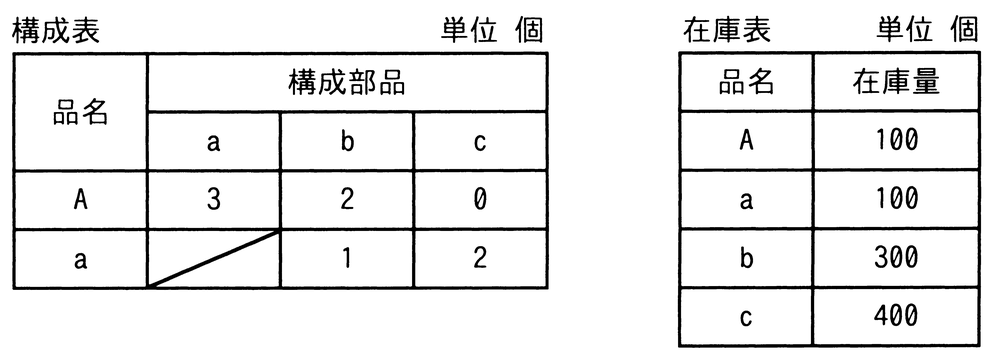

# 令和6年度秋期 問73（ストラテジ）

## 問題文

構成表の製品Aを300個出荷しようとするとき，部品bの正味所要量は何個か。ここで，A，a，b，cの在庫量は在庫表のとおりとする。また，他の仕掛残，注文残，引当残などはないものとする。

ア　200

イ　600

ウ　900

エ　1,500

## 使用画像

## 解答と解説

**正解：イ**

画像の構成表より、製品A1個には部品aが3個・部品bが2個必要であり、部品a1個には部品bが1個・部品cが2個必要である（多段階構成）。在庫量はA=100個、a=100個、b=300個、c=400個である。

計算手順は次のとおり。

1. 製品Aの正味所要量＝総所要量300個－在庫100個＝200個
2. 部品aの総所要量＝Aの正味所要量200個×3＝600個。aの正味所要量＝600個－在庫100個＝500個
3. 部品bの総所要量は、Aから直接必要な分とaの生産に伴って必要な分の合計。
   - Aから直接：Aの正味所要量200個×2＝400個
   - aの生産から：aの正味所要量500個×1＝500個
   - 合計＝400個＋500個＝900個
4. 部品bの正味所要量＝総所要量900個－在庫300個＝600個

したがって、部品bの正味所要量は600個であり、イが正解となる。

**IPA公式：イ**

