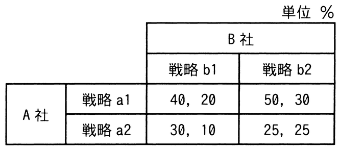

# 令和6年度秋期 問75（ストラテジ）

## 問題文

A社とB社がそれぞれ2種類の戦略を採る場合の市場シェアが表のように予想されるとき，ナッシュ均衡，すなわち互いの戦略が相手の戦略に対して最適になっている組合せはどれか。ここで，表の各欄において，左側の数値がA社のシェア，右側の数値がB社のシェアとする。

ア　A社が戦略a1，B社が戦略b1を採る組合せ

イ　A社が戦略a1，B社が戦略b2を採る組合せ

ウ　A社が戦略a2，B社が戦略b1を採る組合せ

エ　A社が戦略a2，B社が戦略b2を採る組合せ

## 使用画像

## 解答と解説

**正解：イ**

画像の表（単位：%、左がA社シェア、右がB社シェア）は次のとおり。
- (a1, b1) = (40, 20)
- (a1, b2) = (50, 30)
- (a2, b1) = (30, 10)
- (a2, b2) = (25, 25)

ナッシュ均衡は、相手の戦略を固定したときに自分がそれ以上シェアを改善できない（＝互いに最適反応になっている）組合せである。各組合せについてA社・B社それぞれが単独で戦略を変えてシェアを増やせないかを確認する。

- (a1, b1)：A社は40→a2にすると30に下がるので変更しない方が良い（最適）。B社は20→b2にすると30に上がるので変更した方が得（最適ではない）。
- (a1, b2)：A社は50→a2にすると25に下がるので変更しない方が良い（最適）。B社は30→b1にすると20に下がるので変更しない方が良い（最適）。→両者とも最適反応でナッシュ均衡。
- (a2, b1)：A社はa1にすると40に上がるので変更した方が得（最適ではない）。
- (a2, b2)：B社はb1にすると10に下がるので変更しない方が良い（最適）が、A社はa1にすると50に上がるので変更した方が得（最適ではない）。

したがって、両社とも戦略を変える動機がないのは(a1, b2)の組合せのみであり、イが正解となる。

**IPA公式：イ**

