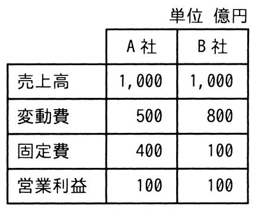

# 令和6年度秋期 問77（ストラテジ）

## 問題文

A社とB社の比較表から分かる，A社の特徴はどれか。

ア　売上高の増加が大きな利益に結び付きやすい。

イ　限界利益率が低い。

ウ　損益分岐点が低い。

エ　不況時にも，売上高の減少が大きな損失に結び付かず不況抵抗力は強い。

## 使用画像

## 解答と解説

**正解：ア**

画像の比較表（単位：億円）は次のとおり。
- A社：売上高1,000、変動費500、固定費400、営業利益100
- B社：売上高1,000、変動費800、固定費100、営業利益100

限界利益（＝売上高－変動費）と限界利益率（＝限界利益÷売上高）を求めると、
- A社：限界利益＝1,000－500＝500、限界利益率＝500／1,000＝50%
- B社：限界利益＝1,000－800＝200、限界利益率＝200／1,000＝20%

損益分岐点売上高（＝固定費÷限界利益率）は、
- A社：400／0.5＝800億円
- B社：100／0.2＝500億円

A社は限界利益率が50%と高く（イは誤り）、売上高の増分がそのまま高い比率で利益に貢献するため、「売上高の増加が大きな利益に結び付きやすい」（ア）は正しい。A社の損益分岐点は800億円でB社の500億円より高く（ウは誤り）、固定費比率・限界利益率がともに高いA社は損益分岐点比率が高く、不況で売上高が減少すると利益が急減しやすい（＝不況抵抗力は弱い）ため、エも誤りである。

**IPA公式：ア**

