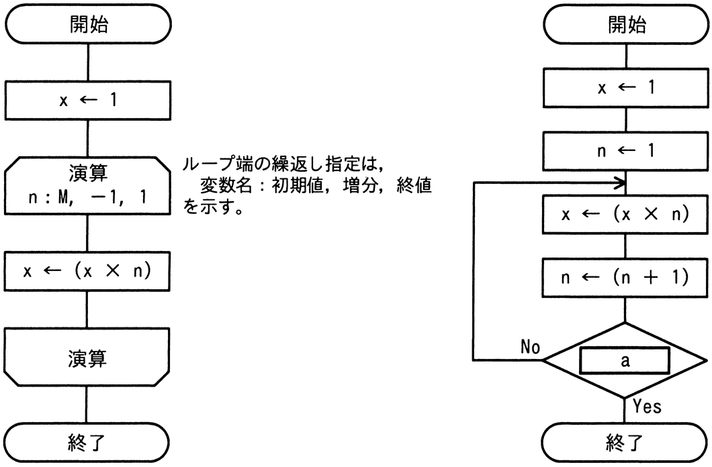

# 令和6年度春期 問5（基礎理論）

## 問題文

正の整数Mに対して，次の二つの流れ図に示すアルゴリズムを実行したとき，結果xの値が等しくなるようにしたい。aに入れる条件として，適切なものはどれか。

ア　n＜M

イ　n＞M−1

ウ　n＞M

エ　n＞M＋1

## 使用画像

## 解答と解説

**正解：ウ**

左の流れ図は、x←1としたのち、nをMから1まで1ずつ減らしながらx←(x×n)を繰り返すループ端指定であり、これはM×(M−1)×…×1、すなわちMの階乗（M！）を計算する処理である。ループはnがMから1まで実行されるため、乗算はちょうどM回行われる。

右の流れ図は、x←1，n←1で初期化し、「x←(x×n)」「n←(n＋1)」を実行した後に条件aを判定し、aがNoならループの先頭（x←(x×n)の直前）に戻り、aがYesならループを終了するという後判定ループである。左と同じ結果（M！）を得るには、nが1からMまでの値のときにx←(x×n)が実行され、n＝Mでの乗算が終わった直後にループを抜ける必要がある。

右のループでは、x←(x×n)実行後にn←(n＋1)でnが1つ進んでから条件判定が行われるため、乗算に使われた最後のnの値はM（更新後の値はM＋1）のときにループを抜けなければならない。つまり判定時点のnがM＋1になった時にYesとなる条件、すなわち「n＞M」が適切である。n＞M−1（イ）ではM回の乗算が完了する前に打ち切られてしまい、n＞M＋1（エ）では余分な乗算（M＋1回目）が行われてしまう。したがって正解はウとなる。

**IPA公式：ウ**

