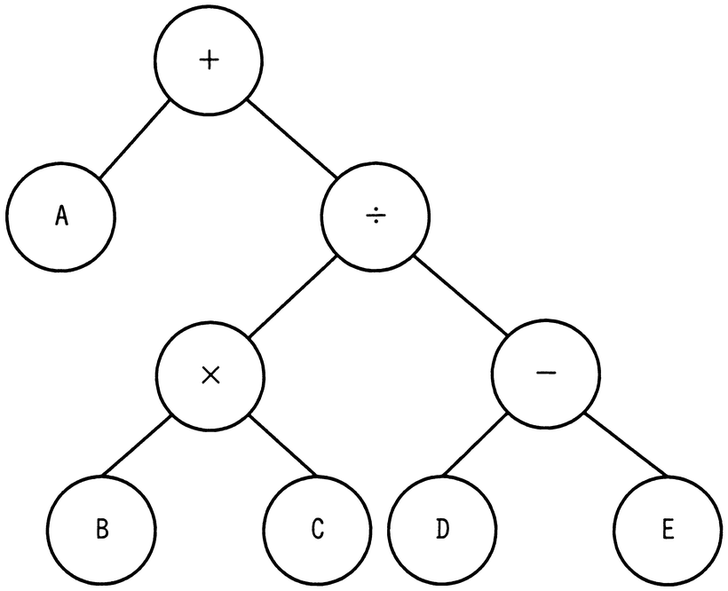

# 令和6年度春期 問6（基礎理論）

## 問題文

各ノードがもつデータを出力する再帰処理f（ノードn）を定義した。この処理を，図の2分木の根（最上位のノード）から始めたときの出力はどれか。

〔f（ノードn）の定義〕

　1．ノードnの右に子ノードrがあれば，f（ノードr）を実行

　2．ノードnの左に子ノードlがあれば，f（ノードl）を実行

　3．再帰処理f（ノードr），f（ノードl）を未実行の子ノード，又は子ノードがなければ，ノード自身がもつデータを出力

　4．終了

ア　＋÷−ED×CBA

イ　ABC×DE−÷＋

ウ　E−D÷C×B＋A

エ　ED−CB×÷A＋

## 使用画像

