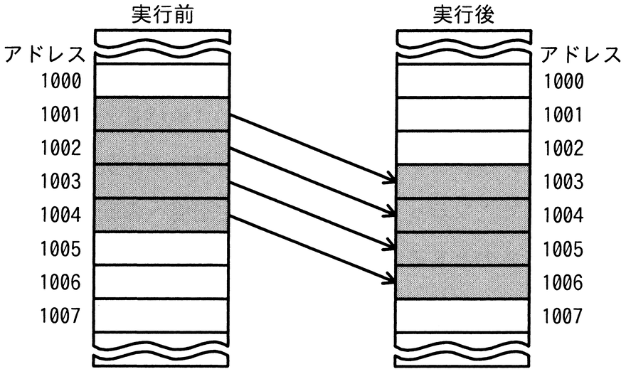
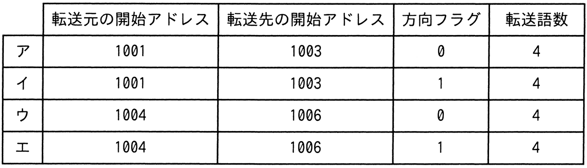

# 令和6年度春期 問8（コンピュータシステム）

## 問題文

同一メモリ空間で，転送元の開始アドレス，転送先の開始アドレス，方向フラグ及び転送語数をパラメータとして指定することによって，データをブロック転送できる機能をもつCPUがある。図のようにアドレス1001から1004のデータをアドレス1003から1006に転送するとき，指定するパラメータとして適切なものはどれか。ここで，転送は開始アドレスから1語ずつ行われ，方向フラグに0を指定するとアドレスの昇順に，1を指定するとアドレスの降順に転送を行うものとする。

## 使用画像

## 解答と解説

**正解：エ**

転送元アドレス1001〜1004のデータを、転送先アドレス1003〜1006へ転送する。両方の範囲は1003〜1004の部分で重なっており、単純に昇順（アドレスの小さい方から）に1語ずつ転送すると、転送元の1003番地・1004番地のデータを転送先として上書きしてしまう前に、それらをまだ転送元として読み出していない場合に、読み出す前のデータが破壊されてしまう問題が起こり得る。

具体的には、昇順に1001→1003, 1002→1004, 1003→1005, 1004→1006と転送すると、1003番地は「1001番地の転送先」として上書きされた後で「1003番地の転送元データ」として読み出されることになり、正しいデータが転送できない。

これを避けるには、アドレスの大きい方（末尾）から降順に転送すればよい。すなわち、転送元の開始アドレスを最も大きい1004、転送先の開始アドレスを最も大きい1006とし、方向フラグを1（降順）に指定して4語を転送すれば、1004→1006, 1003→1005, 1002→1004, 1001→1003の順に転送され、上書きされる前に必要なデータの読み出しが完了する。

これは表のエ（転送元開始アドレス1004，転送先開始アドレス1006，方向フラグ1，転送語数4）と一致する。ア・ウは方向フラグが0（昇順）でありデータ破壊が起こる。イは開始アドレスの指定がアの組み合わせのまま降順にしただけで、正しい範囲を指していない。

**IPA公式：エ**

