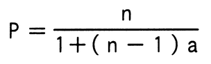

# 令和6年度春期 問14（コンピュータシステム）

## 問題文

1台のCPUの性能を1とするとき，そのCPUをn台用いたマルチプロセッサの性能Pが，

　　

で表されるとする。ここで，aはオーバーヘッドを表す定数である。例えば，a＝0.1，n＝4とすると，P≒3なので，4台のCPUから成るマルチプロセッサの性能は約3になる。この式で表されるマルチプロセッサの性能には上限があり，nを幾ら大きくしてもPはある値以上には大きくならない。a＝0.1の場合，Pの上限は幾らか。

ア　5

イ　10

ウ　15

エ　20

## 使用画像

## 解答と解説

**正解：イ**

図に示された性能Pの式は次のとおりである。

　P ＝ n ／ {1 ＋ (n－1)a}

nを限りなく大きくしたときの極限（上限）を求める。分母・分子をnで割ると、

　P ＝ 1 ／ {1/n ＋ (1－1/n)a}

n→∞のとき、1/n→0となるため、

　P → 1／a

a＝0.1のとき、上限は

　P ＝ 1／0.1 ＝ 10

したがって、Pの上限は10であり、イが正解となる。実際、問題文中の例（a＝0.1，n＝4でP≒3）のように、nを増やすほどPは10に漸近していく。

**IPA公式：イ**

