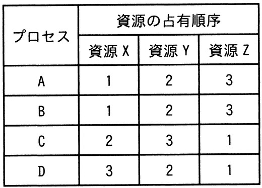

# 令和6年度春期 問17（コンピュータシステム）

## 問題文

三つの資源X〜Zを占有して処理を行う四つのプロセスA〜Dがある。各プロセスは処理の進行に伴い，表中の数値の順に資源を占有し，実行終了時に三つの資源を一括して解放する。プロセスAと同時にもう一つプロセスを動かした場合に，デッドロックを起こす可能性があるプロセスはどれか。

ア　B，C，D

イ　C，D

ウ　Cだけ

エ　Dだけ

## 使用画像

## 解答と解説

**正解：イ**

表より、各プロセスが資源を占有する順序は次のとおりである。

- A：X→Y→Z（Xを1番目，Yを2番目，Zを3番目に占有）
- B：X→Y→Z（Aと全く同じ順序）
- C：Z→X→Y（Xが2番目，Yが3番目，Zが1番目）
- D：Z→Y→X（Xが3番目，Yが2番目，Zが1番目）

デッドロックは、複数のプロセスが互いに相手の保持する資源を待ち合う「循環待ち」が発生したときに起こる可能性がある。

Aと同時に動かすプロセスがBの場合、BはAと全く同じ順序（X→Y→Z）で資源を占有するため、互いに逆順で資源を要求することがなく、循環待ちは発生しない。したがってAとBの組合せではデッドロックは起こらない。

一方、CはAと逆向きの順序（Z→X→Y、すなわちAがXを取ってYを待つ間にCがZを取ってXを待つ、という取り合いが起こり得る順序）で資源を占有するため、AがXを保持しYを要求している間にCがZを保持しXを要求する状況が生じ得て、循環待ちすなわちデッドロックが起こる可能性がある。同様にDもZ→Y→XとAとは逆方向の順序で資源を占有するため、デッドロックが起こる可能性がある。

以上より、Aと同時に動かした場合にデッドロックの可能性があるのはCとDであり、イが正解となる。

**IPA公式：イ**

