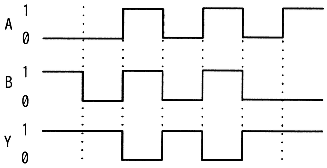
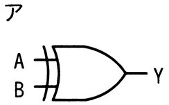
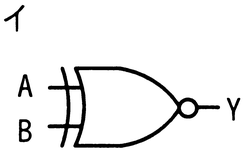
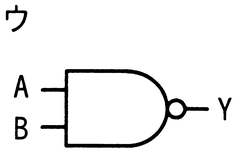
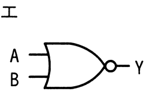

# 令和6年度春期 問21（コンピュータシステム）

## 問題文

入力がAとB，出力がYの論理回路を動作させたとき，図のタイムチャートが得られた。この論理回路として，適切なものはどれか。

## 使用画像

## 解答と解説

**正解：ウ**

タイムチャートを読み取ると，AとBが共に1のときだけYが0になり，それ以外（A=0かつB=0，A=1かつB=0，A=0かつB=1）ではYは1になっている。すなわち，AとBの論理積（AND）を取った結果を反転した出力がYであり，これはNAND（否定論理積）の真理値表と一致する。

選択肢の回路図を見ると，ウはANDゲートの出力に否定（バブル）が付いたNANDゲートであり，タイムチャートの動作と合致する。
- ア：ORゲート（A OR B）→ どちらか一方が1ならYが1になるが，A=B=1でもY=1になってしまい不適合。
- イ：NORゲート（A NOR B）→ A=B=0のときのみY=1となり，チャートと矛盾。
- エ：NORゲート（イと同一の記号）→ 同様に不適合。

したがって，A・Bともに1の区間だけYが0となるNAND回路であるウが適切。

**IPA公式：ウ**

