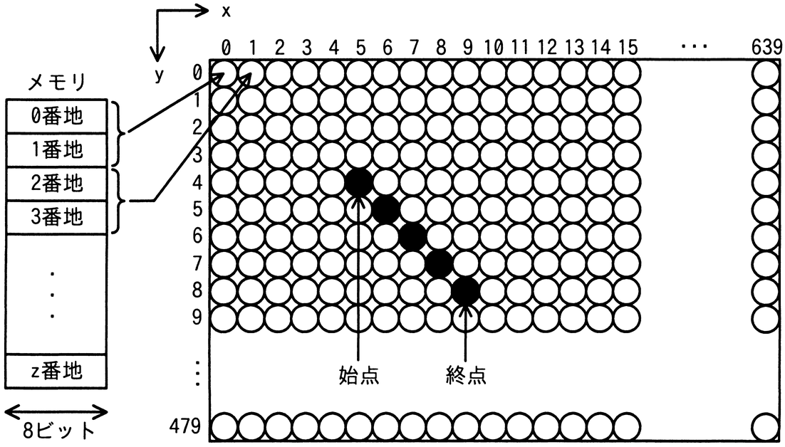

# 令和6年度春期 問22（コンピュータシステム）

## 問題文

次の方式で画素にメモリを割り当てる640×480のグラフィックLCDモジュールがある。始点（5，4）から終点（9，8）まで直線を描画するとき，直線上のx＝7の画素に割り当てられたメモリのアドレスの先頭は何番地か。ここで，画素の座標は（x，y）で表すものとする。

〔方式〕

　・メモリは0番地から昇順に使用する。

　・1画素は16ビットとする。

　・座標（0，0）から座標（639，479）までメモリを連続して割り当てる。

　・各画素は，x＝0からx軸の方向にメモリを割り当てていく。

　・x＝639の次はx＝0とし，yを1増やす。

ア　3847

イ　7680

ウ　7694

エ　8978

## 使用画像

