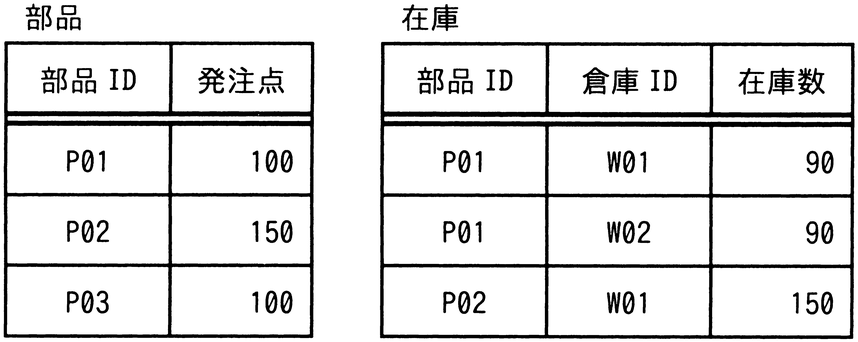
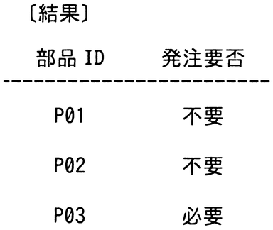

# 令和6年度春期 問26（技術要素）

## 問題文

“部品”表及び“在庫”表に対し，SQL文を実行して結果を得た。SQL文のaに入れる字句はどれか。

〔SQL文〕

　SELECT 部品.部品 ID AS 部品 ID,

　　　CASE WHEN 部品.発注点 >　   a   

　　　　　THEN N'必要' ELSE N'不要' END AS 発注要否

　FROM 部品 LEFT OUTER JOIN 在庫

　　　ON 部品.部品 ID = 在庫.部品 ID

　GROUP BY 部品.部品 ID, 部品.発注点

ア　COALESCE（MIN（在庫.在庫数）, 0）

イ　COALESCE（MIN（在庫.在庫数）, NULL）

ウ　COALESCE（SUM（在庫.在庫数）, 0）

エ　COALESCE（SUM（在庫.在庫数）, NULL）

## 使用画像

## 解答と解説

**正解：ウ**

“部品”表と“在庫”表をLEFT OUTER JOINし，部品IDごとに発注点と在庫数（合計）を比較して発注要否を判定している。結果は次の通り。

- P01：発注点100，在庫はW01=90，W02=90の合計180 → 「不要」
- P02：発注点150，在庫はW01=150の合計150 → 「不要」
- P03：発注点100，在庫レコードなし（LEFT OUTER JOINによりNULL） → 「必要」

`CASE WHEN 部品.発注点 > a THEN N'必要' ELSE N'不要' END` という条件式なので，「発注点 > a」が真のとき「必要」となる。

P01は180，P02は150の在庫があり，いずれも「不要」と判定されているので，aには在庫数の合計（SUM）を用いる必要がある。P03のように在庫レコードが存在しない場合，SUM（在庫.在庫数）はNULLになるため，そのままでは発注点との比較が正しく行えない（NULLとの比較は不定）。COALESCEでNULLを0に変換することで，「発注点(100) > 0」が真となり「必要」と正しく判定できる。

- ア・イ：MIN（在庫.在庫数）では複数倉庫の在庫を合算できず，P01（90+90=180のはずが90になる）などで誤った結果になる。
- エ：COALESCE（…, NULL）では，NULLをNULLに変換するだけで意味がなく，P03の比較が依然として不定になる。

よって，在庫合計をSUMし，NULLを0に変換するウが正しい。

**IPA公式：ウ**

