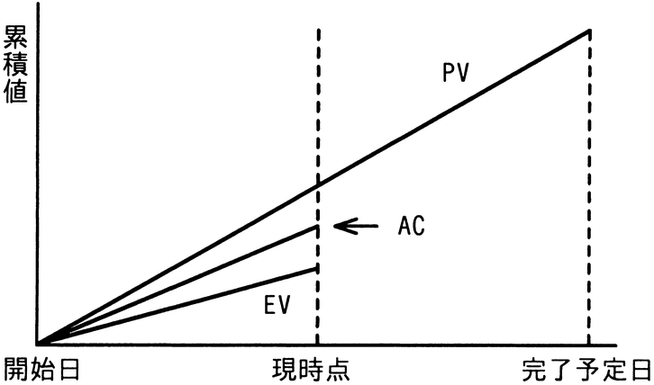

# 令和6年度春期 問51（マネジメント）

## 問題文

EVMで管理しているプロジェクトがある。図は，プロジェクトの開始から完了予定までの期間の半分が経過した時点での状況である。コスト効率，スケジュール効率がこのままで推移すると仮定した場合の見通しのうち，適切なものはどれか。

ア　計画に比べてコストは多くなり，プロジェクトの完了は遅くなる。

イ　計画に比べてコストは多くなり，プロジェクトの完了は早くなる。

ウ　計画に比べてコストは少なくなり，プロジェクトの完了は遅くなる。

エ　計画に比べてコストは少なくなり，プロジェクトの完了は早くなる。

## 使用画像

## 解答と解説

**正解：ア**

図は累積値（コスト・進捗）の推移を示すEVM（アーンドバリューマネジメント）のグラフである。現時点において、PV（計画価値）＞AC（実コスト）＞EV（出来高）という大小関係になっている。

- EV＜PVであることから、計画よりも進捗が遅れている（スケジュールが遅延している）ことが分かる。これはSPI（スケジュール効率指数＝EV／PV）が1未満であることを意味し、この傾向が続けば完了はより遅くなる。
- EV＜ACであることから、出来高に対して実際に投じたコストの方が大きい、すなわちコスト効率が悪い状態である。これはCPI（コスト効率指数＝EV／AC）が1未満であることを意味し、この傾向が続けば最終的なコストは計画（当初予算）より多くなる。

したがって、このままの効率で推移すると、計画に比べてコストは多くなり、プロジェクトの完了は遅くなると見通せる。よって正解はアである。

イ・ウ・エはコストやスケジュールの増減方向がグラフの読み取り（EV＜AC＜PV）と矛盾するため誤りである。

**IPA公式：ア**

