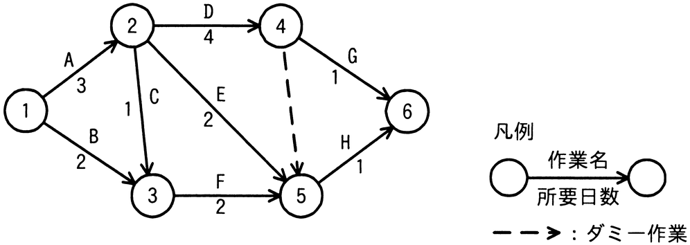

# 令和6年度春期 問52（マネジメント）

## 問題文

図のアローダイアグラムで表されるプロジェクトがある。結合点5の最早結合点時刻はプロジェクトの開始から第何日か。ここで，プロジェクトの開始日は0日目とする。

ア　4

イ　5

ウ　6

エ　7

## 使用画像

## 解答と解説

**正解：エ**

最早結合点時刻は、開始点からその結合点に至る各経路の所要日数のうち、最大値を取ることで求められる（すべての先行作業が完了して初めてその結合点に到達できるため）。

結合点5に至る経路とその日数を洗い出す。

- 1→2→3→5（A=3, C=1, F=2）：3+1+2＝6日
- 1→2→5（A=3, E=2）：3+2＝5日
- 1→3→5（B=2, F=2）：2+2＝4日
- 1→2→4→（ダミー作業）→5（A=3, D=4, ダミー=0）：3+4+0＝7日

これらの経路のうち最大は7日（1→2→4→5のダミー経由）であるため、結合点5の最早結合点時刻はプロジェクト開始から7日目となる。よって正解はエである。

ア・イ・ウはいずれか一部の経路のみを考慮した値であり、最も時間のかかる経路（クリティカルパス側の制約）を見落としているため誤りである。

**IPA公式：エ**

