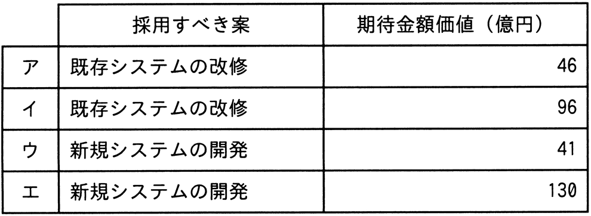

# 令和6年度春期 問54（ストラテジ）

## 問題文

工場の生産能力を増強する方法として，新規システムを開発する案と既存システムを改修する案とを検討している。次の条件で，期待金額価値の高い案を採用するとき，採用すべき案と期待金額価値との組合せのうち，適切なものはどれか。ここで，期待金額価値は，収入と投資額との差で求める。

〔条件〕

　・新規システムを開発する場合の投資額は100億円であって，既存システムを改修する場合の投資額は50億円である。

　・需要が拡大する確率は70％であって，需要が縮小する確率は30％である。

　・新規システムを開発した場合，需要が拡大したときは180億円の収入が見込まれ，需要が縮小したときは50億円の収入が見込まれる。

　・既存システムを改修した場合，需要が拡大したときは120億円の収入が見込まれ，需要が縮小したときは40億円の収入が見込まれる。

　・他の条件は考慮しない。

## 使用画像

## 解答と解説

**正解：ア**

期待金額価値（EMV）は「期待収入（各状況の収入×発生確率の合計）－投資額」で求める。

**新規システムを開発する案**（投資額100億円）

期待収入＝180億円×0.7＋50億円×0.3＝126＋15＝141億円

期待金額価値＝141－100＝41億円

**既存システムを改修する案**（投資額50億円）

期待収入＝120億円×0.7＋40億円×0.3＝84＋12＝96億円

期待金額価値＝96－50＝46億円

両案を比較すると、既存システムを改修する案の期待金額価値46億円の方が、新規システムを開発する案の41億円よりも高い。したがって、採用すべき案は「既存システムの改修」、期待金額価値は46億円であり、これは選択肢アの組合せと一致する。よって正解はアである。

イは既存システム改修案だが金額が誤り、ウ・エは新規システム開発案を採用すべきとしている点で誤りである。

**IPA公式：ア**

