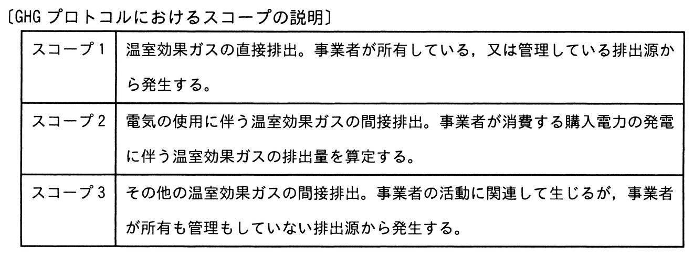

# 令和6年度春期 問57（マネジメント）

## 問題文

温室効果ガスの排出量の算定基準であるGHGプロトコルでは，事業者の事業活動によって直接的，又は間接的に排出される温室効果ガスについて，スコープを三つに分けている。事業者X社がデータセンター事業者であるときの，スコープ1の例として，適切なものはどれか。

ア　X社が自社で管理するIT機器を使用するために購入した電力の，発電に伴う温室効果ガス

イ　X社が自社で管理するIT機器を廃棄処分するときに，産業廃棄物処理事業者が排出する温室効果ガス

ウ　X社が自社で管理する発電装置を稼働させることによって発生する温室効果ガス

エ　X社が提供するハウジングサービスを利用する企業が自社で管理するIT機器を使用するために購入した電力の，発電に伴う温室効果ガス

## 使用画像

## 解答と解説

**正解：ウ**

画像の表のとおり、GHGプロトコルでは温室効果ガスの排出を次の3スコープに分類する。
- スコープ1：事業者が「所有・管理している排出源」から直接発生する排出
- スコープ2：事業者が消費する「購入電力の発電」に伴う間接排出
- スコープ3：その他、事業者の活動に関連するが所有・管理していない排出源からの間接排出

X社（データセンター事業者）のスコープ1に該当するのは、X社自身が所有・管理する設備から直接発生する温室効果ガスである。選択肢ウの「X社が自社で管理する発電装置を稼働させることによって発生する温室効果ガス」は、X社が管理する排出源からの直接排出であり、スコープ1の典型例に該当する。

その他の選択肢は以下のとおりスコープ1ではない。
- ア：X社が購入した電力の発電に伴う排出はスコープ2（購入電力由来の間接排出）。
- イ：産業廃棄物処理事業者が排出する温室効果ガスは、X社の管理外の他社排出であり、バリューチェーン上の間接排出としてスコープ3に該当する。
- エ：ハウジングサービス利用企業が購入した電力の発電に伴う排出は、その利用企業側のスコープ2であり、X社にとってはスコープ3（下流の間接排出）に該当する。

**IPA公式：ウ**

