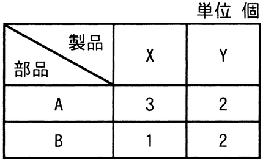

# 令和6年度春期 問75（ストラテジ）

## 問題文

製品X，Yを1台製造するのに必要な部品数は，表のとおりである。製品1台当たりの利益がX，Yともに1万円のとき，利益は最大何万円になるか。ここで，部品Aは120個，部品Bは60個まで使えるものとする。

ア　30

イ　40

ウ　45

エ　60

## 使用画像

## 解答と解説

**正解：ウ**

製品Xの製造台数をx，製品Yの製造台数をyとする。表より，部品Aは製品X1台につき3個，Y1台につき2個必要で上限120個，部品Bは製品X1台につき1個，Y1台につき2個必要で上限60個である。制約条件は次のとおり。

- 3x + 2y ≤ 120（部品Aの制約）
- x + 2y ≤ 60（部品Bの制約）
- x ≥ 0，y ≥ 0

利益はX，Yともに1台1万円なので，利益（万円）= x + y を最大化する線形計画問題となる。2つの制約式の境界線の交点を求めると，3x+2y=120 と x+2y=60 を連立させ，辺々を引くと 2x=60 より x=30，これを x+2y=60 に代入すると y=15 となる。この点での利益は x+y=30+15=45（万円）。

境界の端点（x=40,y=0：利益40）や（x=0,y=30：利益30）と比較しても，交点(30,15)における利益45が最大となる。よって正解はウの45である。

**IPA公式：ウ**

