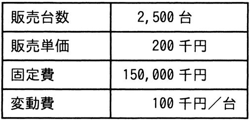

# 令和6年度春期 問76（ストラテジ）

## 問題文

今年度のA社の販売実績と費用（固定費，変動費）を表に示す。来年度，固定費が5％増加し，販売単価が5％低下すると予測されるとき，今年度と同じ営業利益を確保するためには，最低何台を販売する必要があるか。

ア　2,575

イ　2,750

ウ　2,778

エ　2,862

## 使用画像

## 解答と解説

**正解：エ**

今年度の営業利益をまず求める。
今年度の営業利益 ＝ 販売台数×単価 － 販売台数×変動費 － 固定費
＝ 2,500台×200千円 － 2,500台×100千円 － 150,000千円
＝ 500,000 － 250,000 － 150,000 ＝ 100,000千円

来年度は固定費が5％増加し、販売単価が5％低下する。
・来年度固定費 ＝ 150,000千円×1.05 ＝ 157,500千円
・来年度販売単価 ＝ 200千円×0.95 ＝ 190千円
・変動費は変わらず100千円/台

来年度も同じ営業利益100,000千円を確保するために必要な販売台数をxとすると、
190x － 100x － 157,500 ＝ 100,000
90x ＝ 257,500
x ＝ 2,861.1…

台数は整数かつ「最低何台」必要かを問われているため切り上げて2,862台となる。

**IPA公式：エ**

