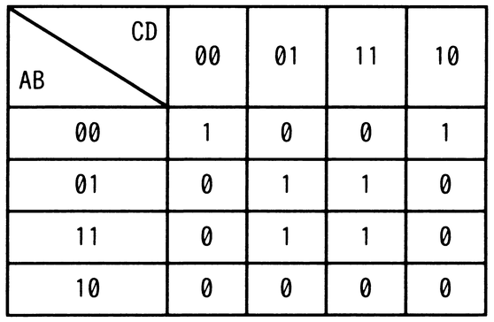

# 令和7年度秋期 問1（基礎理論）

## 問題文

A，B，C，Dを論理変数とするとき，次のカルノー図と等価な論理式はどれか。ここで，・は論理積，＋は論理和，XはXの否定を表す。

ア　A・B・C・D＋B・D

イ　A・B・C・D＋B・D

ウ　A・B・D＋B・D

エ　A・B・D＋B・D

## 使用画像

## 解答と解説

**正解：エ**

カルノー図で1が入っているマスをグループ化して簡単化する。

- AB=00,CD=00とAB=00,CD=10のマス（1が入っている）は、AB=00の列でCDが00と10、すなわちB=0,D=0の組み合わせで、A=0,B=0,D=0（C=0/1で共通）→ B・D の項としてまとめられる（AB=00列は上下でCDが00,10、B=0,D=0が共通）。
- AB=01,CD=01とAB=01,CD=11、AB=11,CD=01とAB=11,CD=11の4マスは、B=1,D=1が共通（A,Cは0/1両方）→ B・D の項としてまとめられる。

この二つの項を論理和でつなぐと「B・D＋B・D」となり、それぞれのマスを漏れなくカバーする最小項の組合せが選択肢エと一致する。したがって正解はエとなる。

**IPA公式：エ**
