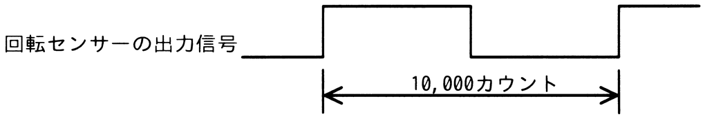

# 令和7年度秋期 問10（コンピュータシステム）

## 問題文

モーターの軸に装着された回転センサーから出力されるパルスの周期を，1MHzのクロック周波数でカウントアップするタイマーで計測したところ，10,000カウントであった。モーターの回転数は毎秒何回転か。ここで，回転センサーはモーターの軸が1回転するごとに図のようなパルスを2回出力するものとする。

ア　50

イ　100

ウ　200

エ　5,000

## 使用画像

## 解答と解説

**正解：ア**

タイマーのクロック周波数は1MHz（1秒間に1,000,000カウント）である。図が示す10,000カウントは、パルス1周期（Highの1区間分、すなわちパルス1回分の周期）に相当する時間を計測したものである。

パルス1回分の周期の時間 ＝ 10,000 ／ 1,000,000 ＝ 0.01秒（10ミリ秒）

回転センサーはモーターの軸が1回転するごとにパルスを2回出力するため、モーター1回転あたりの時間は、パルス周期の2倍となる。

1回転の時間 ＝ 0.01秒 × 2 ＝ 0.02秒

したがって、1秒間当たりの回転数（毎秒回転数）は、

回転数 ＝ 1 ／ 0.02 ＝ 50〔回転／秒〕

これは選択肢アに一致する。

**IPA公式：ア**
