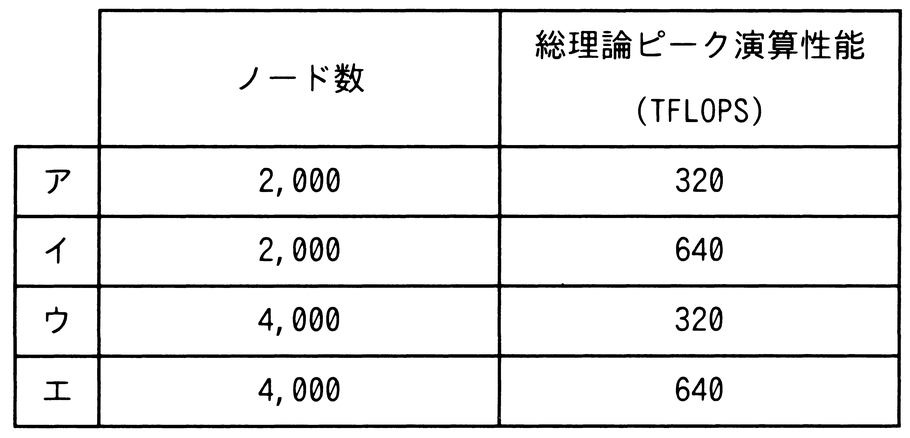

# 令和7年度秋期 問11（コンピュータシステム）

## 問題文

現状のHPC（High Performance Computing）マシンの構成を，次の条件で更新することにした。更新後の，ノード数と総理論ピーク演算性能はどれか。ここで，総理論ピーク演算性能は，コア数に比例するものとする。

〔現状の構成〕

　（1）一つのコアの理論ピーク演算性能は10GFLOPSである。

　（2）一つのノードのコア数は8である。

　（3）ノード数は1,000である。

〔更新条件〕

　（1）一つのコアの理論ピーク演算性能を現状の2倍にする。

　（2）一つのノードのコア数を現状の2倍にする。

　（3）総コア数を現状の4倍にする。

## 使用画像

## 解答と解説

**正解：イ**

現状の総コア数は、1ノードあたりのコア数8 × ノード数1,000 ＝ 8,000コアである。

更新条件（3）より、更新後の総コア数は現状の4倍なので、

8,000 × 4 ＝ 32,000コア

更新条件（2）より、1ノードあたりのコア数は現状の2倍の8×2＝16コアになるので、更新後のノード数は、

32,000 ／ 16 ＝ 2,000ノード

次に総理論ピーク演算性能を求める。現状の1コアの性能は10GFLOPSであり、更新条件（1）より2倍の20GFLOPSになる。総理論ピーク演算性能はコア数に比例するので、

更新後の総理論ピーク演算性能 ＝ 20GFLOPS × 32,000コア ＝ 640,000GFLOPS ＝ 640TFLOPS

以上より、ノード数2,000、総理論ピーク演算性能640TFLOPSとなる選択肢イが正解である。

**IPA公式：イ**
