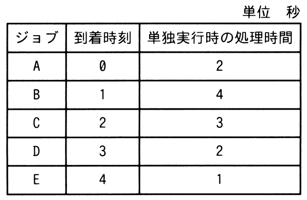

# 令和7年度秋期 問15（コンピュータシステム）

## 問題文

五つのジョブA〜Eに対して，ジョブの多重度が1で，処理時間順方式のスケジューリングを適用した場合，ジョブBのターンアラウンドタイムは何秒か。ここで，OSのオーバーヘッドは考慮しないものとする。

ア　8

イ　9

ウ　10

エ　11

## 使用画像

## 解答と解説

**正解：エ**

処理時間順方式（SJF：Shortest Job First、多重度1・非プリエンプティブ）では、CPUが空いた時点でそれまでに到着済みのジョブの中から処理時間が最も短いものを選んで実行する。各ジョブの到着時刻・処理時間は、A(0,2)、B(1,4)、C(2,3)、D(3,2)、E(4,1)である。

- 時刻0：Aのみ到着。Aを実行（0〜2）。
- 時刻2：到着済みはB(4)，C(3)。最短のCを実行（2〜5）。
- 時刻5：到着済みはB(4)，D(2)，E(1)。最短のEを実行（5〜6）。
- 時刻6：到着済みはB(4)，D(2)。最短のDを実行（6〜8）。
- 時刻8：残るBを実行（8〜12）。

ジョブBは時刻12に完了する。ターンアラウンドタイムは「完了時刻－到着時刻」であるから、

ターンアラウンドタイム ＝ 12 − 1 ＝ 11〔秒〕

これは選択肢エに一致する。

**IPA公式：エ**
