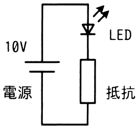

# 令和7年度秋期 問20（コンピュータシステム）

## 問題文

図のLED点灯回路において，LEDに10ミリAの電流が流れるように抵抗値を決定したときに，回路全体の消費電力に占めるLEDの消費電力の割合は何％か。ここで，LEDの順方向電圧は2Vとし，電源の消費電力は無視するものとする。

ア　20

イ　25

ウ　80

エ　100

## 使用画像

## 解答と解説

**正解：ア**

回路は電源（10V）、抵抗、LEDが直列に接続されている。直列回路のため、抵抗とLEDには同じ電流（10mA）が流れる。

LEDの順方向電圧は2Vなので、電源電圧10Vのうち残りの電圧は抵抗にかかる。

抵抗の電圧 ＝ 10V − 2V ＝ 8V

各素子の消費電力（P＝V×I）を求めると、

LEDの消費電力 ＝ 2V × 10mA ＝ 20mW
抵抗の消費電力 ＝ 8V × 10mA ＝ 80mW

回路全体の消費電力（電源の消費電力は無視するので、LEDと抵抗の合計）は、

全体の消費電力 ＝ 20mW ＋ 80mW ＝ 100mW

LEDの消費電力が全体に占める割合は、

割合 ＝ 20mW ／ 100mW ＝ 0.2 ＝ 20％

これは選択肢アに一致する。

**IPA公式：ア**
