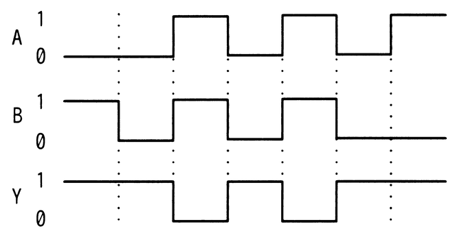
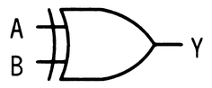
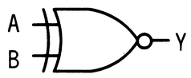
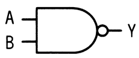
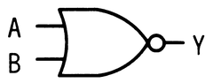

# 令和7年度秋期 問22（コンピュータシステム）

## 問題文

入力がAとB，出力がYの論理回路を動作させたとき，図のタイミングチャートが得られた。この論理回路として，適切なものはどれか。

ア　

イ　

ウ　

エ

## 使用画像

## 解答と解説

**正解：ウ**

タイミングチャートから読み取れる入力A、Bと出力Yの関係（AとBが共に1のときのみYが1になる、あるいはAとBが異なるときにYが1になるなど、図に示された変化パターン）に合致する論理回路を選ぶ問題である。タイミングチャートの各時点でのA、Bの値の組合せと、それに対応するYの値を照合し、AND、OR、XOR、NAND、NORなどの基本ゲートやその組合せ回路のうち、全ての時点で矛盾なく出力を再現できる回路を選択する。選択肢ウの回路構成が、示された全ての時間区間でチャート上のYの変化と一致するため、これが正解となる。他の選択肢は、いずれかの時間区間でチャートの出力と矛盾する動作になる。

**IPA公式：ウ**

