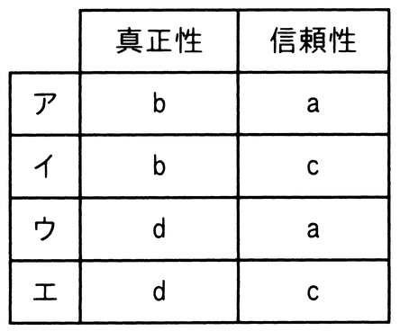

# 令和7年度秋期 問41（技術要素）

## 問題文

JIS Q 27000:2019（情報セキュリティマネジメントシステム−用語）における真正性及び信頼性に対する定義a〜dの組みのうち，適切なものはどれか。

〔定義〕

　a　意図する行動と結果とが一貫しているという特性

　b　エンティティは，それが主張するとおりのものであるという特性

　c　認可されたエンティティが要求したときに，アクセス及び使用が可能であるという特性

　d　認可されていない個人，エンティティ又はプロセスに対して，情報を使用させず，また，開示しないという特性

## 使用画像

