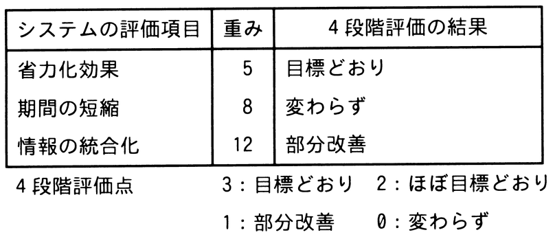

# 令和7年度秋期 問65（ストラテジ）

## 問題文

定性的な評価項目を定量化するために評価点を与える方法がある。表に示す4段階評価を用いた場合，重み及び4段階評価の結果から評価されたシステム全体の目標達成度は，評価項目が全て目標どおりだった場合の評価点に対し，何％となるか。

ア　27

イ　36

ウ　43

エ　52

## 使用画像

## 解答と解説

**正解：イ**

図の表から，各評価項目の重みと4段階評価点（目標どおり＝3，ほぼ目標どおり＝2，部分改善＝1，変わらず＝0）を対応付けると次のとおりである。

- 省力化効果：重み5，結果「目標どおり」（3点）→ 5×3＝15
- 期間の短縮：重み8，結果「変わらず」（0点）→ 8×0＝0
- 情報の統合化：重み12，結果「部分改善」（1点）→ 12×1＝12

実績評価点の合計は 15＋0＋12＝27。全ての評価項目が目標どおり（3点）だった場合の評価点は，重みの合計25（＝5＋8＋12）に3を掛けた75点である。

したがって目標達成度は 27／75＝0.36＝36％となり，イが正しい。

**IPA公式：イ**
