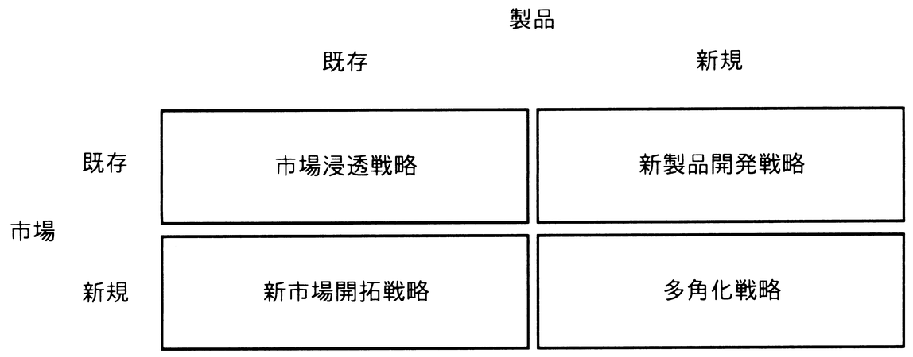

# 令和7年度秋期 問70（ストラテジ）

## 問題文

図のアンゾフの成長マトリクスのうち，市場浸透戦略の例として，適切なものはどれか。

ア　ある商品が高いシェアを確保したため，最近の技術開発の成果を取り入れた上位機種を，既存のユーザー向けに販売する。

イ　ある地域において特別価格で販売することで，商品の知名度を上げ，その地域の多くの住民に販売する。

ウ　ある地方で長年販売してきた商品を，今年から他の地方でも販売する。

エ　販売実績がないある国の商習慣に合う製品を一から開発し，その国で販売する。

## 使用画像

