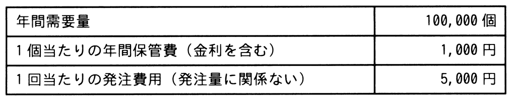
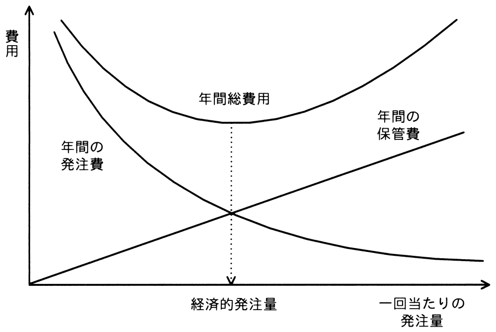

# 令和7年度秋期 問74（ストラテジ）

## 問題文

ある工場で扱っている部品Aは，使用量（需要）が一定であり，定量発注方式を採用して発注されている。この場合の経済的発注量は，グラフの年間の発注費と，年間の保管費が等しくなったときの値を計算することで求めることができる。表の条件の場合の経済的発注量を求めよ。ここで，部品Aに関する安全在庫は考慮しないものとする。

ア　10

イ　200

ウ　500

エ　1,000

## 使用画像

## 解答と解説

**正解：エ**

経済的発注量（EOQ）は，年間の発注費用の合計と年間の保管費用の合計が等しくなる発注量として求められる。発注量をQ，年間需要量をD，1回当たりの発注費用をS，1個当たりの年間保管費用をHとすると，

年間発注費＝D／Q×S，年間保管費＝Q／2×H

の両者が等しくなるQを求めればよく，これを解くと Q＝√(2DS／H) となる。

表の値（D＝100,000個，S＝5,000円，H＝1,000円）を代入すると，

Q＝√(2×100,000×5,000／1,000)＝√1,000,000＝1,000

となる。したがって，経済的発注量は1,000個であり，エが正しい。

**IPA公式：エ**
