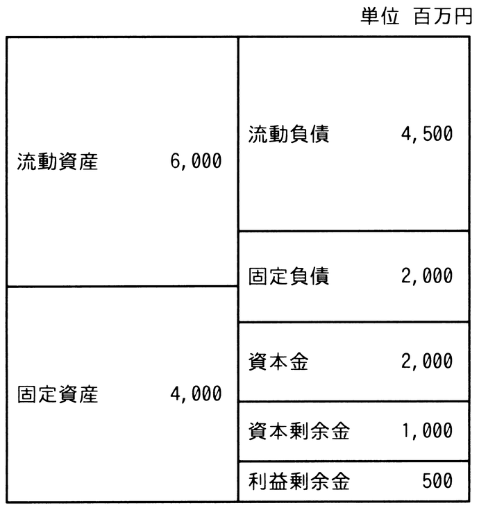

# 令和7年度秋期 問76（ストラテジ）

## 問題文

A社の貸借対照表の構成は図のとおりであった。A社の自己資本比率は何％か。

ア　10

イ　20

ウ　30

エ　35

## 使用画像

## 解答と解説

**正解：エ**

自己資本比率とは，総資本（総資産）に占める自己資本（返済不要の株主資本）の割合を示す財務指標であり，次の式で求められる。

自己資本比率＝自己資本／総資本×100

貸借対照表の図より，自己資本は資本金2,000＋資本剰余金1,000＋利益剰余金500＝3,500（百万円）である。一方，総資本（総資産）は流動資産6,000＋固定資産4,000＝10,000（百万円）である（流動負債4,500と固定負債2,000は他人資本であり自己資本には含めない）。

したがって，自己資本比率＝3,500／10,000×100＝35％となり，エが正しい。

**IPA公式：エ**
