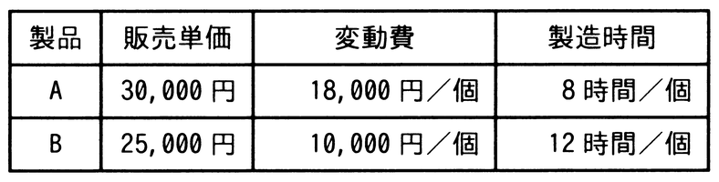

# 令和7年度秋期 問77（ストラテジ）

## 問題文

表のような製品A，Bを製造，販売する場合，考えられる利益は最大で何円になるか。ここで，機械の年間使用可能時間は延べ15,000時間とし，年間の固定費は製品A，Bに関係なく15,000,000円とする。

ア　3,750,000

イ　7,500,000

ウ　16,250,000

エ　18,750,000

## 使用画像

## 解答と解説

**正解：イ**

機械の使用可能時間という制約条件が存在するため，製品ごとに「時間当たりの限界利益（＝(販売単価－変動費)／製造時間）」を比較し，効率の良い製品を優先的に製造するのが最適である。

- 製品A：限界利益＝30,000－18,000＝12,000円／個，製造時間8時間／個 → 時間当たり限界利益＝12,000／8＝1,500円／時間
- 製品B：限界利益＝25,000－10,000＝15,000円／個，製造時間12時間／個 → 時間当たり限界利益＝15,000／12＝1,250円／時間

製品Aの方が時間当たりの限界利益が高いため，年間使用可能時間15,000時間を全て製品Aの製造に充てるのが最適である。製品Aの製造可能数量は15,000／8＝1,875個であり，総限界利益は1,875×12,000＝22,500,000円となる。

ここから年間固定費15,000,000円を差し引くと，利益＝22,500,000－15,000,000＝7,500,000円となる。したがって，イが正しい。

**IPA公式：イ**
