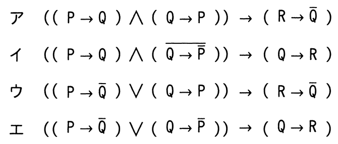

# 令和7年度春期 問1（基礎理論）

## 問題文

論理式P，Qがいずれも真であるとき，論理式Rの真偽にかかわらず真になる式はどれか。ここで，“￣”は否定を，“∨”は論理和を，“∧”は論理積を，“→”は含意（“真→偽”となるときに限り偽となる演算）を表す。

## 使用画像

## 解答と解説

**正解：エ**

P，Qがともに真（P＝T，Q＝T）のとき，各選択肢の前件（→の左側）が恒偽（常に偽）になれば，含意全体は後件やRの真偽に関係なく常に真となる。

エの式は（（P→Q̄）∨（Q→P̄））→（Q→R）である。P＝T，Q＝Tのとき，Q̄＝F，P̄＝Fなので，P→Q̄＝T→F＝F，Q→P̄＝T→F＝Fとなり，前件（F∨F＝F）は常に偽になる。したがって「偽→（Q→R）」は，Rの値によらず常に真となる。

他の選択肢（ア，ウなど）は，前件が真になる場合が残るため，後件（R→Q̄など）の真偽がRに依存してしまい，Rの値によっては式全体が偽になり得る。したがって，Rの真偽にかかわらず必ず真になるのはエだけである。

**IPA公式：エ**

