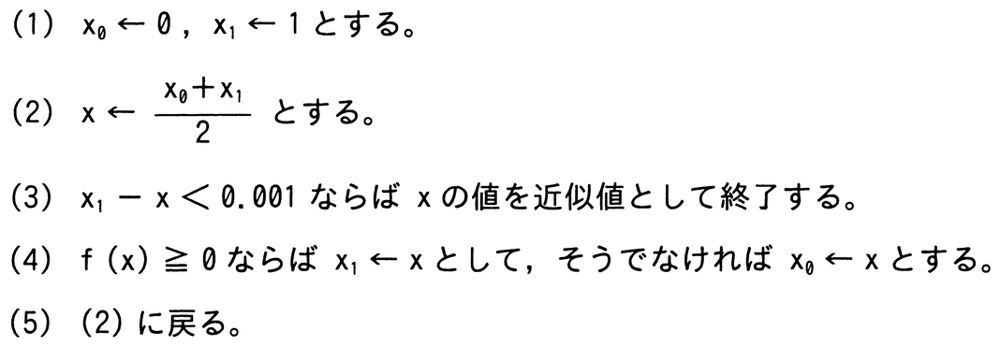

# 令和7年度春期 問2（基礎理論）

## 問題文

0≦x≦1の範囲で単調に増加する連続関数f（x）がf（0）＜0≦f（1）を満たすときに，区間内でf（x）＝0であるxの値を近似的に求めるアルゴリズムにおいて，（2）は何回実行されるか。

〔アルゴリズム〕

ア　10

イ　20

ウ　100

エ　1,000

## 使用画像

## 解答と解説

**正解：ア**

このアルゴリズムは二分探索法（区間の中点を求めて，符号に応じて区間を半分に狭めていく処理）で方程式の近似解を求めるものである。

初期区間は[x0, x1]＝[0, 1]で幅は1。手順(2)〜(5)を1回実行するたびに，区間の幅は半分になる。手順(3)の終了条件は「x1－x＜0.001」，すなわち区間の幅が0.001未満になったら終了する。

区間の幅は最初1で，n回実行後には1／2ⁿとなる。1／2ⁿ＜0.001を満たす最小のnを求めると，2ⁿ＞1000であり，2¹⁰＝1024＞1000なので，n＝10回で条件を満たす。

したがって，手順(2)が実行される回数は10回であり，正解はアとなる。

**IPA公式：ア**

