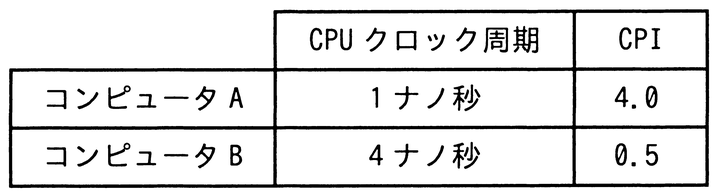

# 令和7年度春期 問8（コンピュータシステム）

## 問題文

同じ命令セットをもつコンピュータAとBとがある。それぞれのCPUクロック周期，及びあるプログラムを実行したときのCPI（Cycles Per Instruction）は，表のとおりである。そのプログラムを実行したとき，コンピュータAの処理時間は，コンピュータBの処理時間の何倍になるか。

ア　1／32

イ　1／2

ウ　2

エ　8

## 使用画像

## 解答と解説

**正解：ウ**

プログラムの処理時間は「クロック周期×CPI×命令数」で求められる。命令セット・命令数は同じであるため，命令数を1として1命令あたりの処理時間で比較する。

コンピュータA：クロック周期1ナノ秒×CPI4.0＝4ナノ秒／命令
コンピュータB：クロック周期4ナノ秒×CPI0.5＝2ナノ秒／命令

コンピュータAの処理時間は，コンピュータBの処理時間の 4／2＝2 倍となる。

したがって正解はウである。クロック周期が短くてもCPIが大きければ実際の処理時間は長くなる点に注意が必要である。

**IPA公式：ウ**

