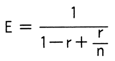

# 令和7年度春期 問11（コンピュータシステム）

## 問題文

マルチプロセッサによる並列処理で得られる高速化率（単一プロセッサのときと比べた倍率）Eを，次の式によって評価する。r＝0.9のアプリケーションの高速化率がr＝0.3のものの3倍となるのは，プロセッサが何台のときか。

　ここで，

　　n：プロセッサの台数（1≦n）

　　r：対象とする処理のうち，並列化が可能な部分の割合（0≦r≦1）

とし，並列化に伴うオーバーヘッドは考慮しないものとする。

ア　3

イ　4

ウ　5

エ　6

## 使用画像

