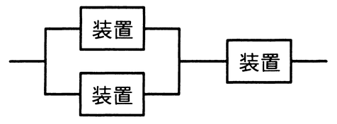
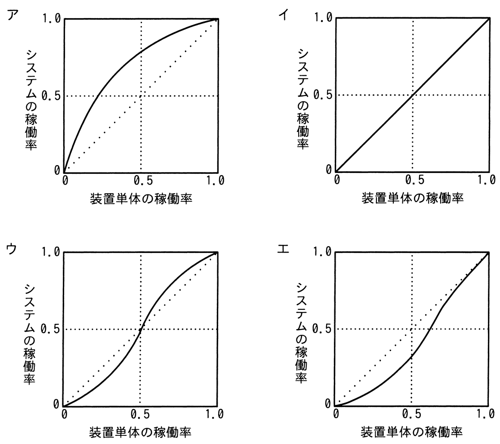

# 令和7年度春期 問13（コンピュータシステム）

## 問題文

図のように3個の装置を並列と直列に組み合わせて構成したシステムがある。装置単体の稼働率と，システムの稼働率の関係を示したグラフはどれか。ここで，3個の装置の稼働率は，全て等しいものとする。

## 使用画像

## 解答と解説

**正解：エ**

図の構成は，2台の装置を並列接続したユニットに，さらに1台の装置を直列接続したものである。装置単体の稼働率をaとすると，並列部分の稼働率は 1－(1－a)²＝2a－a² であり，これに直列の1台をかけたシステム全体の稼働率は，

f(a)＝(2a－a²)×a＝2a²－a³

となる。a＝0.5のときf(0.5)＝2×0.25－0.125＝0.375となり，対角線（y＝x）の値0.5より小さい。つまりグラフはx＝0.5付近で対角線の下側を通る。

a＝0付近ではf(a)はaの2次以上の関数なので立ち上がりが緩やかにゼロに近づき（下に凸），aが大きくなるにつれて対角線に近づき，a＝1でf(1)＝1となる。この，低い稼働率域では対角線より下，高い稼働率域に近づくにつれ対角線に接近するという特徴を持つのはエのグラフである。

**IPA公式：エ**

