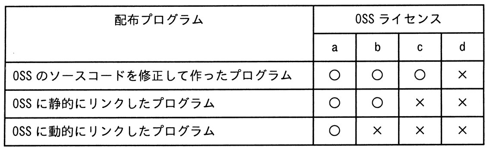
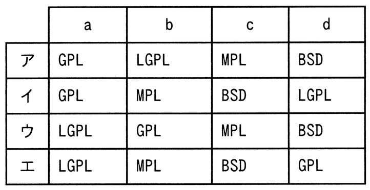

# 令和7年度春期 問16（コンピュータシステム）

## 問題文

表は，OSSのライセンスごとに，そのライセンスのOSSを利用したプログラムを配布するとき，ソースコードを公開しなければならないかどうかを示す。a〜dに入れるライセンスの適切な組合せはどれか。ここで，表中の“○”は公開しなければならないことを表し，“×”は公開しなくてもよいことを表す。

## 使用画像

## 解答と解説

**正解：ア**

各OSSライセンスの特徴を，表の3つの配布パターン（ソース修正，静的リンク，動的リンク）に照らして整理すると次のようになる。

・GPL：コピーレフト性が最も強く，修正・静的リンク・動的リンクいずれの場合も，配布時にソースコード開示が義務付けられる（○○○）。
・LGPL：ライブラリ向けの緩やかなライセンスで，修正・静的リンクの場合はソース開示が必要だが，動的リンクのみで利用する場合は開示不要（○○×）。
・MPL：ファイル単位のコピーレフトで，OSS自体を修正した場合のみソース開示が必要。リンク（静的・動的）だけの利用では開示不要（○××）。
・BSD：非コピーレフト型で，改変・リンクいずれの場合もソースコード開示の義務はない（×××）。

表のa列（○○○）＝GPL，b列（○○×）＝LGPL，c列（○××）＝MPL，d列（×××）＝BSDとなる。この組合せに一致するのは選択肢アである。

**IPA公式：ア**

