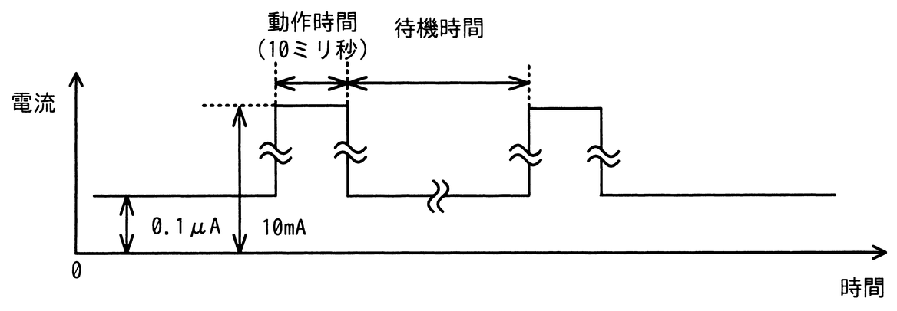

# 令和7年度春期 問21（コンピュータシステム）

## 問題文

IoTシステムにおいて，センサーの値をゲートウェイに送信するセンサーノードの消費電流を抑えるため，図のような間欠動作を考える。センサーノードの動作時間は10ミリ秒で，その間は平均して10mAの電流が流れる。待機中は常に0.1μAの電流が流れる。間欠動作の平均電流を1μA以下にするための待機時間として，最も短いものはどれか。ここで，平均電流の値を求める時間は十分に長いものとする。

ア　1.1秒

イ　11.1秒

ウ　111.1秒

エ　1111.1秒

## 使用画像

