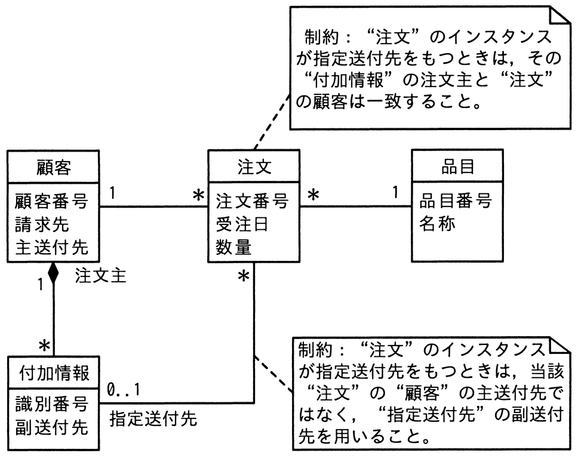

# 令和7年度春期 問25（技術要素）

## 問題文

UMLを用いて表した図のデータモデルを関係データベース上に実装する際の解釈のうち，適切なものはどれか。

ア　“指定送付先”を指定する際，“付加情報”表のどの行でも選択できる。

イ　“付加情報”表と“顧客”表の行数は一致していなければならない。

ウ　“付加情報”表には“顧客”表に対する参照制約を指定する。

エ　“付加情報”表には“注文”表に対する参照制約を指定する。

## 使用画像

## 解答と解説

**正解：ウ**

画像のUML図では、“付加情報”表は“顧客”表に対して多重度「1」対「*」の集約（コンポジション寄り）の関係にあり、“付加情報”の各行は必ずいずれかの“顧客”の行（注文主）に属している。したがって関係データベース上では、“付加情報”表に“顧客”表の主キー（顧客番号）を外部キーとしてもたせ、参照制約（外部キー制約）を指定することで、この関連を実装する。よってウが適切である。

他の選択肢は誤り。アは“指定送付先”が“付加情報”表の任意の行を選べるように読めるが、注釈にあるとおり「注文主と一致する顧客に紐づく付加情報」でなければならないという制約があるため誤り。イは多重度が1対多（1対0..*）であり、両表の行数が一致する必要はないため誤り。エは“付加情報”表は“注文”表そのものへの直接の参照制約ではなく“顧客”への参照制約を基本としつつ、指定送付先として“注文”との関連（0..1対*）をもつ構造であり、単純に「“注文”表に対する参照制約」とするのは不正確である。

**IPA公式：ウ**

