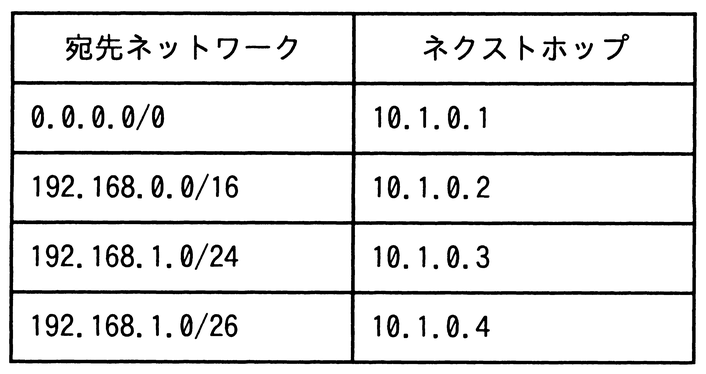

# 令和7年度春期 問31（技術要素）

## 問題文

次のルーティングテーブルをもつルータが宛先IPアドレス192.168.1.1のパケットを受信したとき，選択されるネクストホップはどれか。ここで，宛先IPアドレスの条件を満たす宛先ネットワークが複数あるときは，それらのうちで，サブネットマスクが最も長い宛先ネットワークのネクストホップを選択する。

ア　10.1.0.1

イ　10.1.0.2

ウ　10.1.0.3

エ　10.1.0.4

## 使用画像

